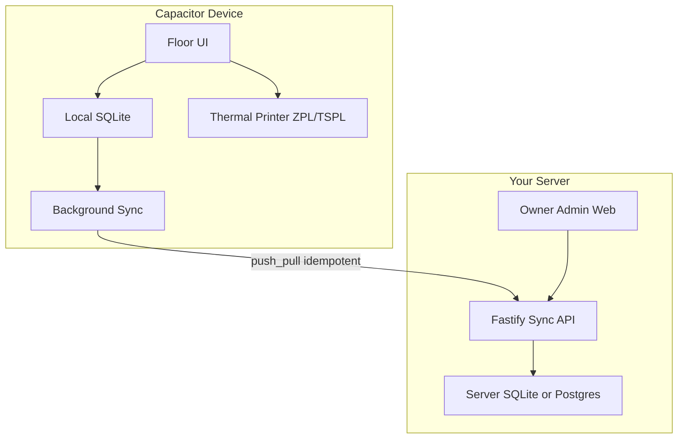

# Maxwell Trading — Offline-First Product Plan

## Verdict

The current repo is a **metals ERP + thin Maxwell CRUD layer**. That is not the product. We rebuild around warehouse reality: **local-first floor ops**, **strict lineage**, **direct sticker print**, and **owner-facing analytics** — metals code removed.

---

## Business north star (owner / sales lens)

Owners and sales people need answers in seconds, not data entry screens:

- Where is every meter right now (inward / mill / cutting / godown / parcel / dispatched)?
- Which rolls and packings are aging in godown?
- Which mills still hold open job work?
- Can we fulfill this challan’s required codes from what we have, and where?
- Trace any packing/parcel sticker back to supplier roll in one lookup

Floor staff need something different: **scan → type meters → Enter → sticker prints**, even with bad Wi‑Fi.

---

## Design principles (non-negotiable)

1. **Offline-first + eventual consistency** — Write to device SQLite first; background worker syncs to your Fastify server when online.
2. **Edge critical path &lt;10s** — Packing ID generation and print never wait on the network.
3. **Hardware-direct print** — Capacitor client talks to thermal printers over LAN/Bluetooth (ZPL/TSPL), not cloud print.
4. **Absolute lineage** — Roll → many Packings → Parcel groups Packings → Challan scans Parcels/Packings. No orphans; soft deletes only.
5. **Idempotent sync** — Client-generated UUID is the idempotency key; retries must not double-create stock.
6. **Conflict = human review** — If local edit collides with server “already dispatched”, flag for manager; never silent overwrite.

---

## Domain model (replace current `tx_*` semantics)

Evolve / replace Maxwell tables to match physical goods. Client generates UUIDs for Packing and Parcel.

| Entity | Role | Key fields |
|---|---|---|
| **ItemCharter** | Specs only | code, name, color/design, quality (extend as needed) |
| **SupplierRoll** | Parent roll | `roll_id`, `supplier_id`, `original_meterage`, `remaining_meterage`, status (`inward` / `at_job_work` / `in_cutting` / `depleted`) |
| **JobWorkLedger** | Mill movement | `roll_id`, `job_worker_id`, outward/inward dates, processed state |
| **Packing** | Core scannable unit | `packing_id` (UUID), `parent_roll_id` (**required**), `length_meters`, design/color code, godown location, status |
| **Parcel** | Consolidation | `parcel_id` (UUID), nested packing IDs, total qty, status |
| **DeliveryChallan** | Fulfillment | `challan_id`, order/required material codes, scanned parcel/packing IDs, dispatch status |

**Hard rules:**
- Every Packing must have `parent_roll_id` (no more `source_type=manual` orphans).
- Cutting deducts from roll `remaining_meterage` locally; sync reconciles with server version + conflict rules.
- Soft delete columns (`deleted_at`) everywhere inventory moves.

Mapping from today’s code (for migration mindset):
- `tx_stock_in` ≈ SupplierRoll (add remaining balance + status machine)
- `tx_mill_out` / `tx_mill_return` ≈ JobWorkLedger
- `tx_packing` ≈ Packing (UUID + mandatory parent roll)
- **new** Parcel (does not exist today)
- `tx_challans` / items ≈ DeliveryChallan (scan parcels + packings; required material checklist)

---

## Critical floor modules (Capacitor)

### A. Cutting & Packing (P0)

1. Scan SupplierRoll  
2. Enter cut length → Enter  
3. Locally: new Packing UUID, deduct roll balance, write outbox event, build ZPL/TSPL payload, send to printer  
4. Sync later  

### B. Parcel Consolidation (P1)

Create parcel → scan 3–4 packing IDs → validate not already in a parcel → Parcel UUID → mark packings `consolidated` → print master sticker (nested codes/colors).

### C. Floor Dispatch (P1)

Open active challan → checklist of required material codes + location hints → scan packing/parcel → mark found → reject mismatch with alert/buzzer → dispatch when checklist satisfied (partial policy: allow only if owner config says so; default = block incomplete).

---

## Sync & API

- **Outbox pattern** on device: every local write → `sync_outbox` row (`entity`, `client_id`, `payload`, `updated_at`, `status`).
- **POST `/sync/push`**: batch upsert by client UUID; return `applied` / `conflict` / `rejected`.
- **GET `/sync/pull`**: changes since cursor (`updated_at` + id).
- Conflicts (e.g. packing already `dispatched` on server): store in `sync_conflicts` for manager UI; device notified.
- Auth: keep token auth against your server; roles expand later to Admin / Packing / Godown / Floor.

Server stays Fastify; keep SQLite initially on server for speed to ship, with schema written so Postgres swap is possible later if needed. No change to “your own server” hosting model.

---

## Strip metals ERP

Delete / stop registering legacy surface so Maxwell is the only product:

- API routes: `orders`, `purchase`, `dispatch`, `payments`, `returns`, `jobwork` (metals), `inventory` (kg), `dashboard` (kg), metals `sync` CSV — remove from [`apps/api/src/index.ts`](apps/api/src/index.ts)
- Web pages: `OrdersPage`, `PurchasePage`, `DispatchPage`, `BillingPage`, `PaymentsPage`, `ReturnsPage`, `JobWork*`, metals `DashboardPage`, `InventoryPage`, etc.
- Schema: stop seeding/migrating metals tables for new installs; leave old DB tables inert or drop in a dedicated cleanup migration once confirmed empty
- Rename workspace branding from `jigness` → Maxwell where practical

Keep: auth, users bootstrap, and any reusable UI primitives (tables, forms).

---

## App surfaces

| Surface | Tech | Audience |
|---|---|---|
| **Floor app** | React + Vite + **Capacitor** (Android first), local SQLite, camera/BT/LAN print plugins | Packing, godown, floor manager |
| **Owner admin web** | Same React codebase or `apps/web` online-only | Admin, owners, sales — masters, challan create, analytics, conflict review |

Shared domain types in a small `packages/shared` workspace package (entities, Zod schemas, sync payload shapes).

---

## Owner analytics (web, online)

Built against server truth after sync:

- Stock position by stage (meters + piece counts)
- Mill WIP / days outstanding
- Godown location heatmap / rack hints
- Aging (packed / in godown / consolidated)
- Challan fill rate and shortages by material code
- Lineage search: Packing or Parcel → Roll → Supplier → Job work → Challan
- Daily/weekly movement (in / cut / packed / dispatched)

Use `recharts` already in web; new `/analytics/*` APIs on Maxwell tables only.

---

## Phased delivery order

1. **Foundation** — strip metals; shared types; new schema + soft deletes; idempotent sync API stubs  
2. **Capacitor shell** — Android project, local SQLite, outbox worker, auth against your server  
3. **Packing critical path** — roll scan, cut, local ID, print adapter (start with one printer protocol: ZPL default)  
4. **Parcel + challan floor** — consolidation + checklist dispatch  
5. **Owner admin** — masters, challan creation, analytics, conflict review  

---

## Explicit defaults (locked for this plan)

- **Printer:** ZPL over LAN TCP first; Bluetooth/TSPL as follow-up adapter behind same print interface  
- **IDs:** UUID v4 generated on device for Packing and Parcel; human-readable short codes optional as display aliases  
- **Server DB:** continue SQLite on your server for v1; schema discipline for later Postgres  
- **Partial challan:** blocked by default until checklist complete  
- **Platform:** Android Capacitor first; iOS later  
- **Metals:** removed from product surface entirely  

---

## What we are not doing in v1

- Cloud print routing  
- Silent conflict overwrite  
- Orphan / manual packings without parent roll  
- Keeping metals modules “just in case” in the UI  

When you say go, execution starts at phase 1 (strip metals + domain schema + sync contract).
